#  Проектна работы по курсу Observability в Otus

## Тема
«Мониторинг корпоравного портала Битрикс» 

## Инфраструктуры
Инфраструктура состоит из следуюших нод:

bitrix - корпоравный портал на Битрикс  
prometeus -  мониторинг и оповещения  
elk - логирование  
grafana - визуализация

В качестве стека мониторинга используются:

Exporter's - экспортеры метрик  
Prometheus - хранилище метрик  
Beats - агент сбора логов  
Elasticsearch - система агрегации логов 
Elastic APM - система мониторинга производительности приложений 
Grafana - визуализация

###  Корпоравный портал на Битрикс
!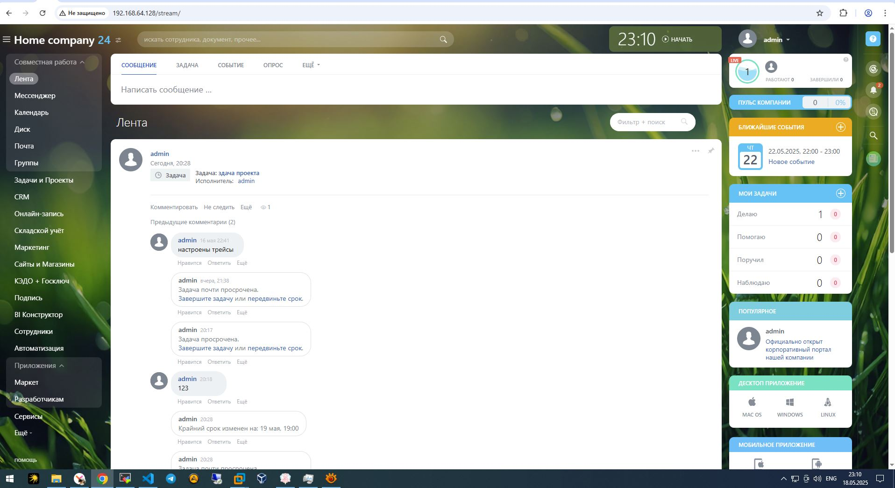

## Дашборды и метрики
Метрики собираются при помощи отдельных экспортеров (node, blackbox...). В графане мы получаем возможность наблюдать за  метриками передаваемыми экспортерами

### 
Дашбоард работы портала
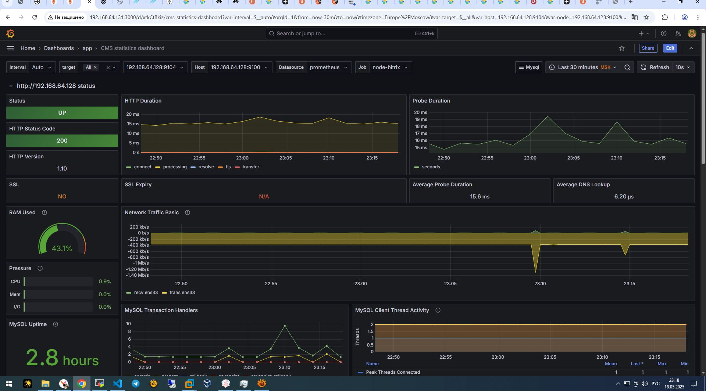

Дашбоард инраструктуры

Дашборд MYSQL 
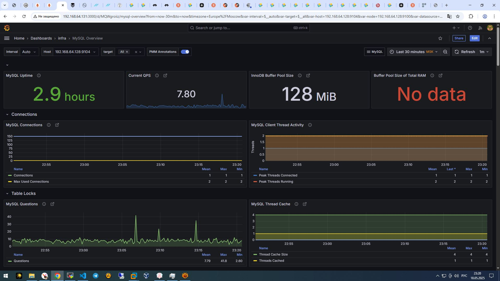

## Логирование

С помощью beats организован сбор логов о работе сервисов и отправка в elastick
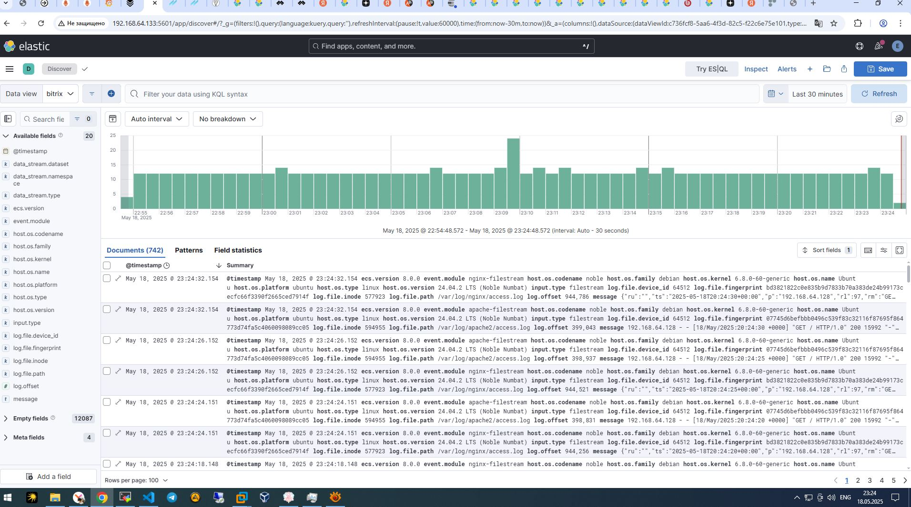

##Трейсинг
APM-server сервер получает данные от php агента установленного на портале и отпраляе в elastic
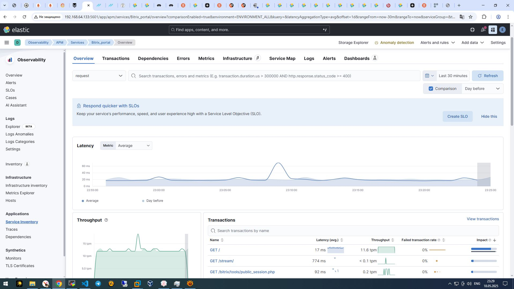
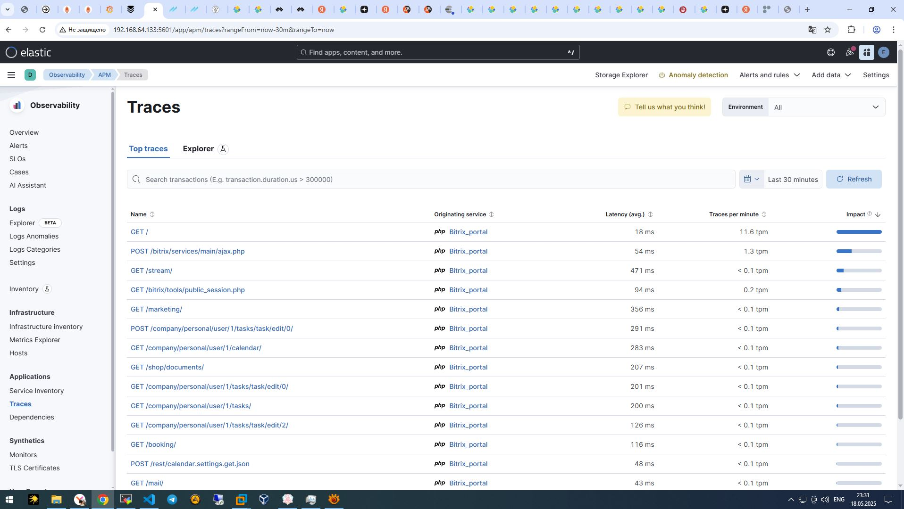
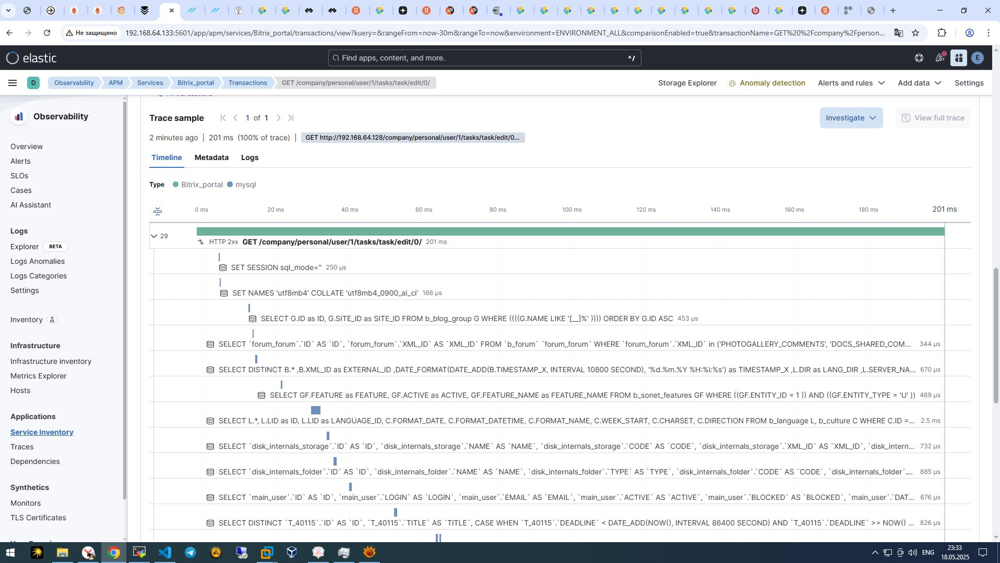

## Алертинг

Настроен алертинг о недоступности сайта, недоступности хоста, загрузка ЦП и памяти. Доставка уведомлений осуществляется в Telegram.

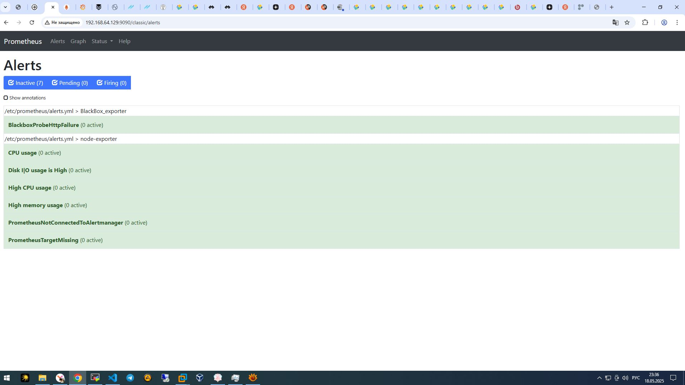
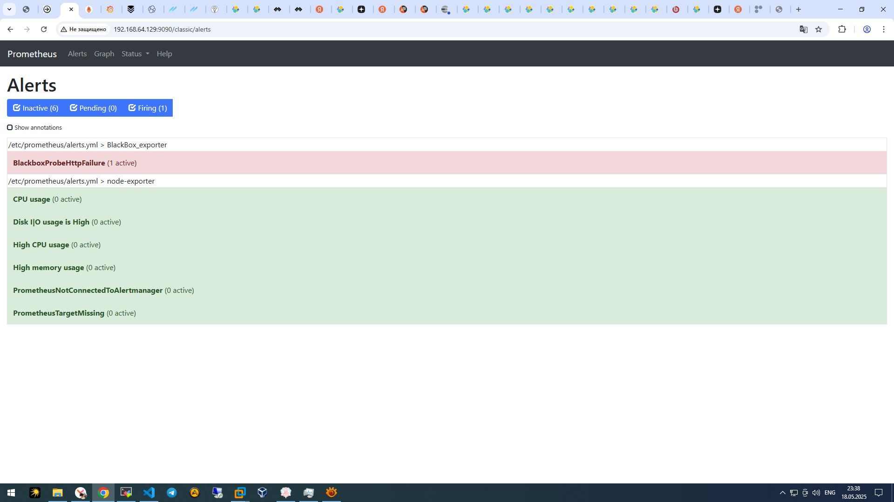
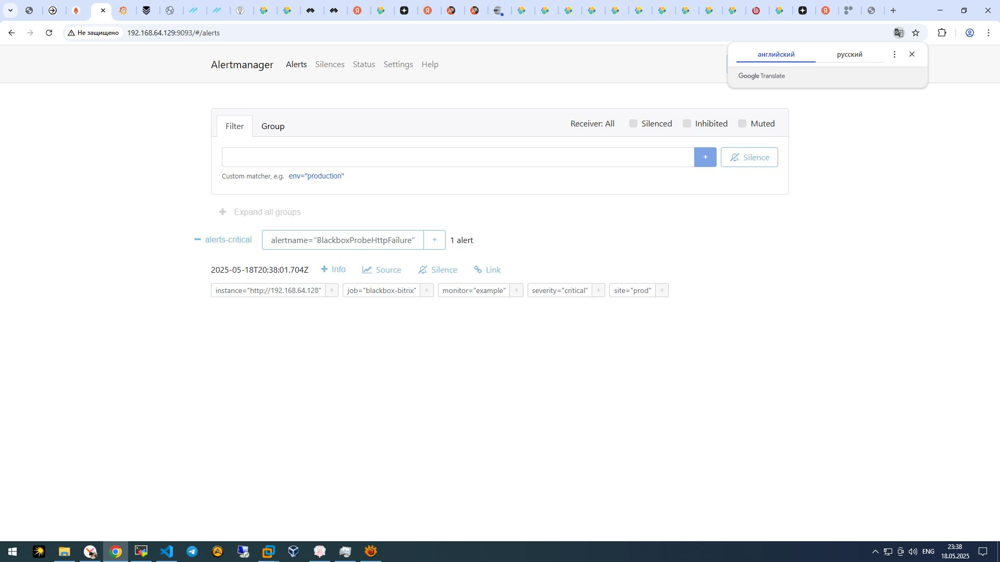
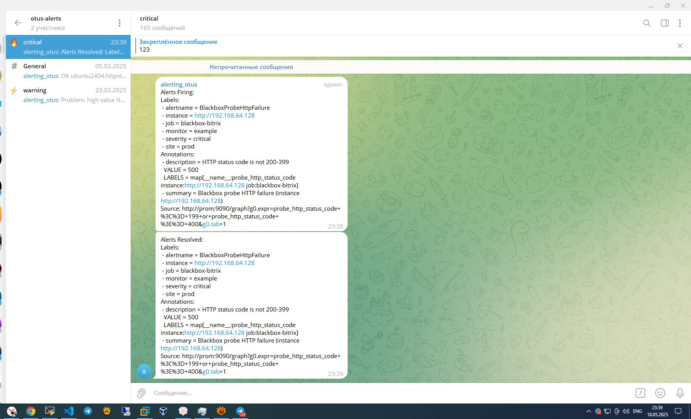

