# 1. Установка и настройка Prometheus, использование exporters

В каталоге [GAP-1](GAP-1) находятся файлы конфигурации prometheus и alertmanager

Процесс установки находится в каталоге install

### Развернут wordpres, prometheus, grafana, alertmanager и exporters

##Развернут wordpres, prometheus, grafana, alertmanager и exporters

# 2. Разворачивание хранилища метрик VictoriaMetrics

### Проверка отправки метрик в хранилище

### Подключение DataSource в Grafana

# 3. Алертинг
### Уведомления в telegram

# 4. Grafana - продвинутое использование

### app

### infra

# 5. Развернут Zabbix

### скрипт генерирующий метрики:

    #!/bin/bash

    # Генерация трех случайных метрик со значением от 0 до 100
    metric1=$((RANDOM % 101))
    metric2=$((RANDOM % 101))
    metric3=$((RANDOM % 101))

    # Создание JSON-объекта
    json_output=$(jq -n \
    --arg metric1 "$metric1" \
    --arg metric2 "$metric2" \
    --arg metric3 "$metric3" \
    '{
        "data": [
        { "{#METRIC}": "metric1", "{#VALUE}": $metric1 },
        { "{#METRIC}": "metric2", "{#VALUE}": $metric2 },
        { "{#METRIC}": "metric3", "{#VALUE}": $metric3 }

        ]
    }')

    # Вывод JSON
    echo "$json_output"

Добавлен UserParameter

     UserParameter=otus, /etc/zabbix/zabbix_agent2.d/otus_metrics.sh

### Настройка 

### Получение метрик

### Алертинг

# 6. TICK stack

### Процесс развертывания стэка [TICK-1](install/install%20-tick)

### Настройка dashboard
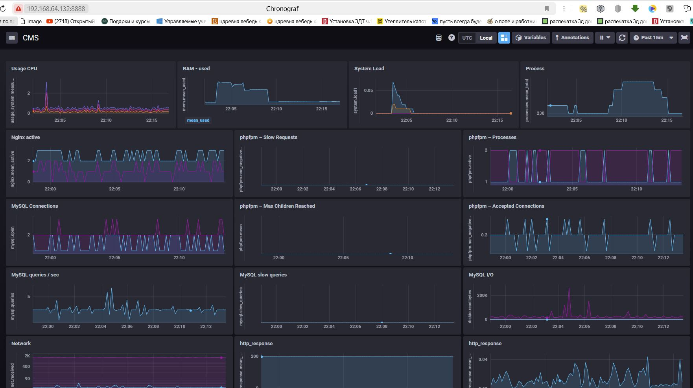

### Добавлены TICKscripts 
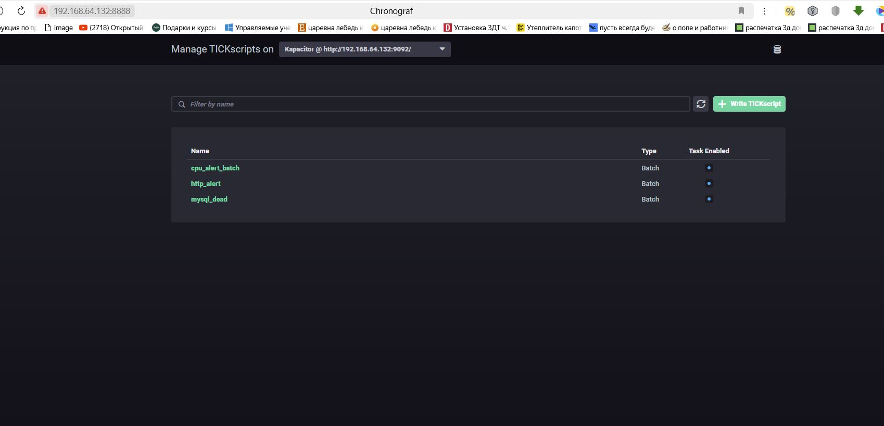

## Отправка alerts в Telegram
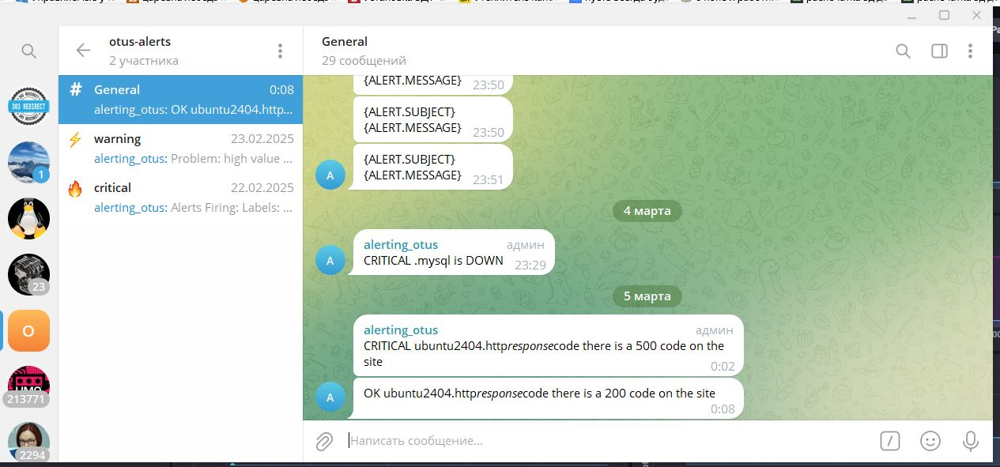

# 7. Beats - инструменты доставки данных

### Заметки по развертывания  [elastic & kibana](install/install-elk)

### Файлы конфигурации beats:
- [Filebeate](ELK-1/filebeat.yml)
- [Metricbeat ](ELK-1/metricbeat.yml)
- [Heartbeat](ELK-1/heartbeat.yml)

### Полученные данные в Kibana
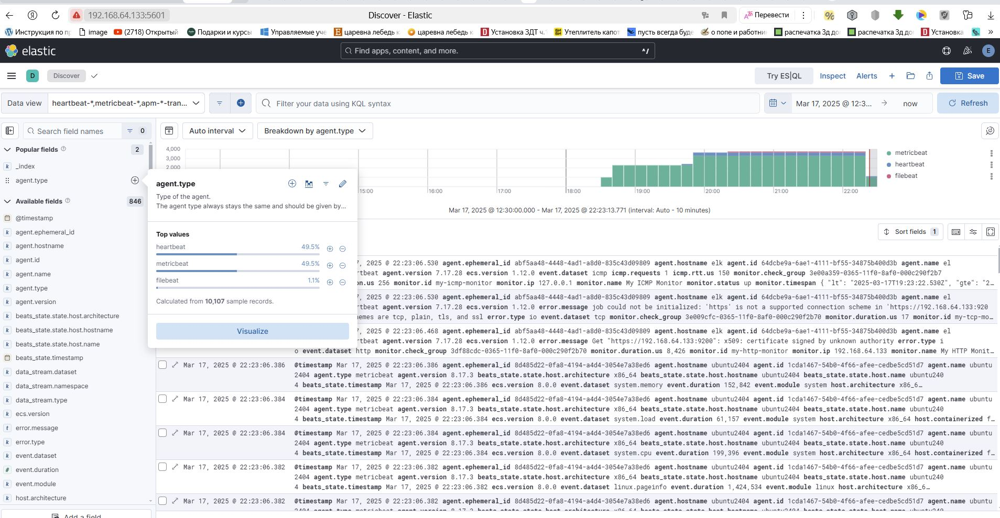

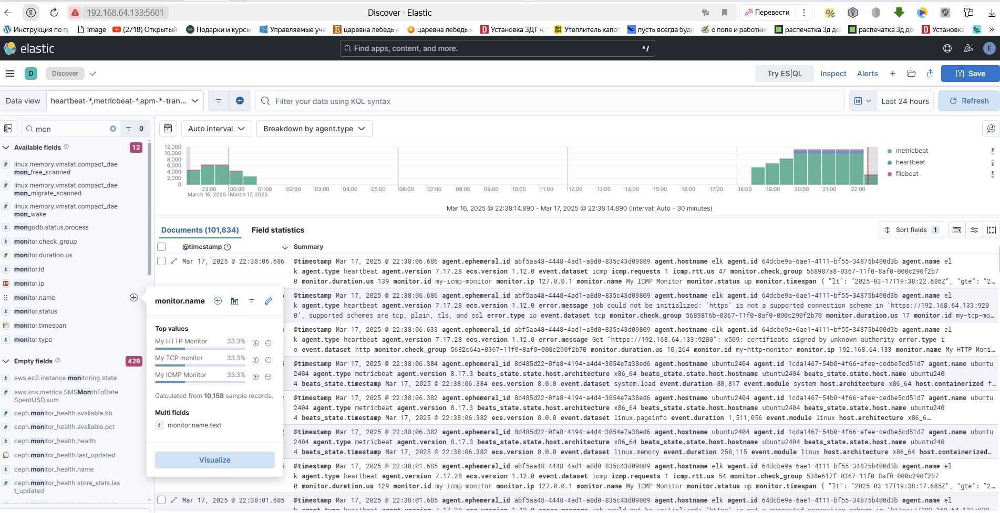

# 8. Системы агрегации сообщений Logstash/Vector 
### beats настроены на отправку в logstash  [filebeat](ELK-2/filebeat.yml), [metricbeat](ELK-2/metricbeat.yml)
### Файлы конфигурации:
- [Logstash](ELK-2/my.conf)
- [Vector](ELK-2/vector.yaml)

### Полученные данные в Kibana
Данные из logstash
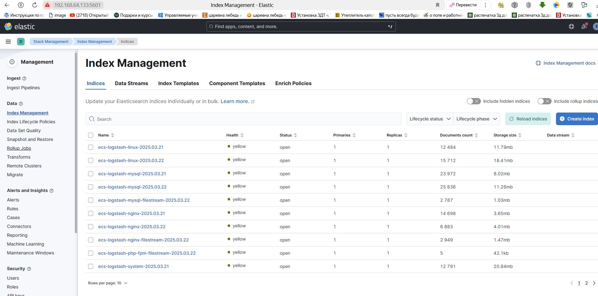

Данные из Vector
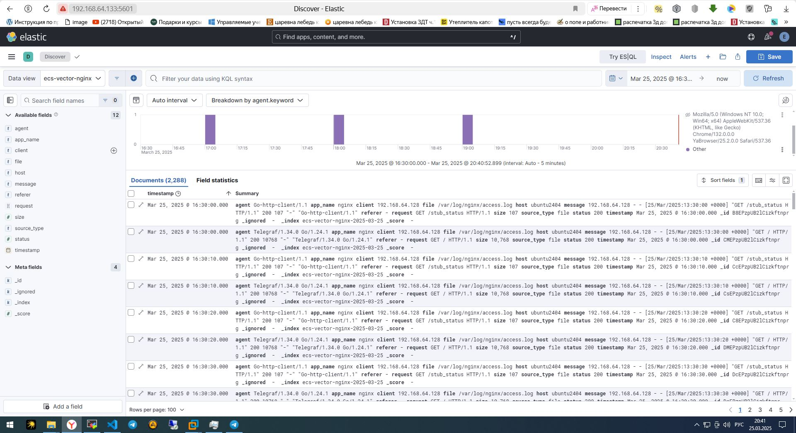

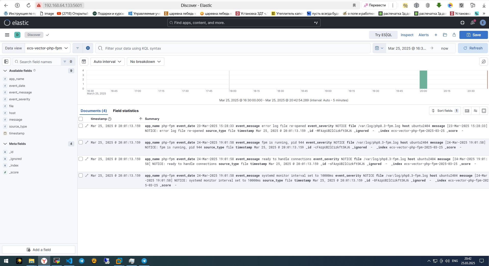

# 9. Grafana Loki - управление логами и доставка 
### Развернута Grafana и Grafana Loki. Шипером выбран promtail. 
### Файлы конфигурации:
- [Promtail](Loki/promtail-local-config.yaml)
- [Grafana Loki](Loki/loki-local-config.yaml)

### Полученные данные
#### Promtail
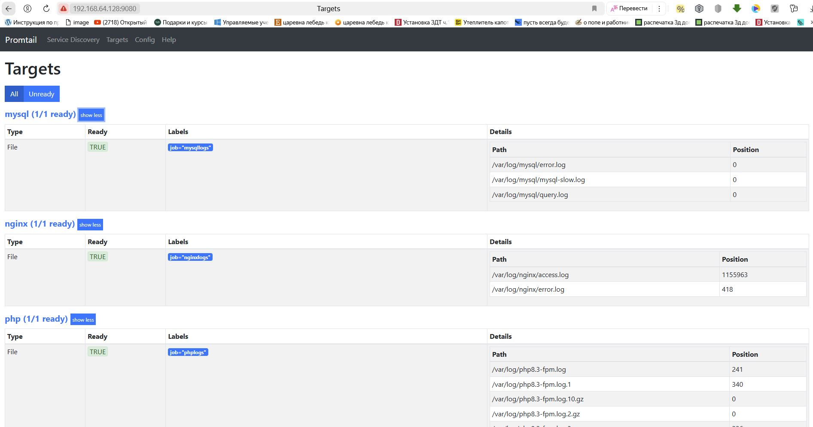

#### Grafana Loki
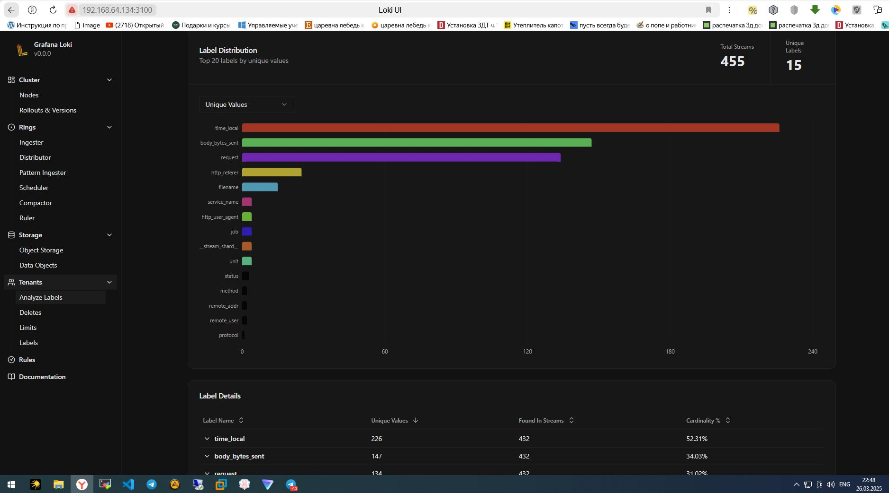

#### Grafana
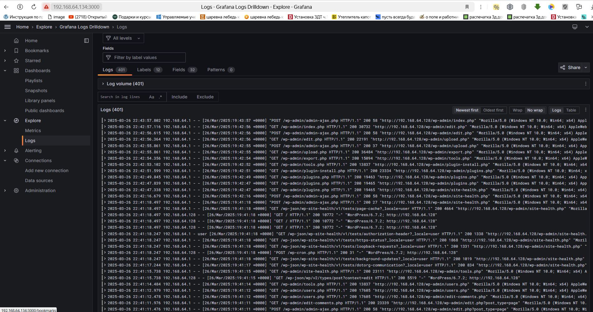
